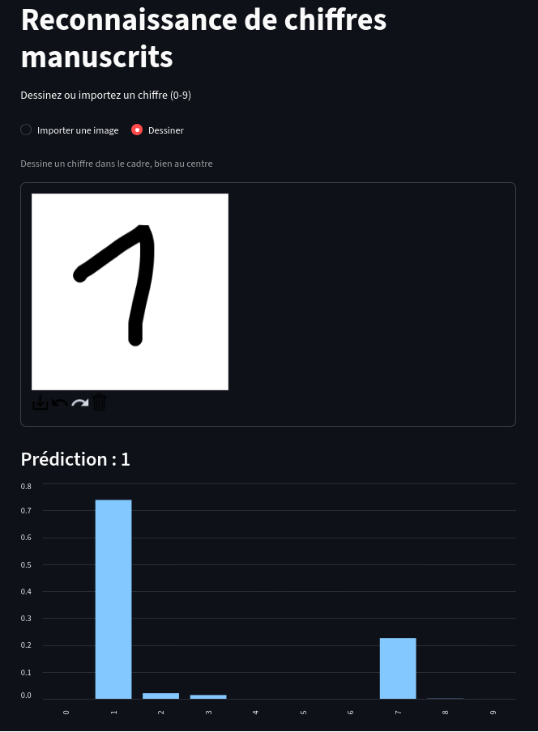

# mnist-digit-recognizer

Application web qui reconnaît un chiffre écrit à la main (0 à 9). On peut importer une image ou dessiner le chiffre directement dans le navigateur, et l'app affiche la prédiction du modèle avec la probabilité de chaque chiffre.

Le modèle est un réseau de neurones convolutif (CNN) entraîné sur le dataset MNIST avec Keras, et l'interface est faite avec Streamlit.



## Fonctionnalités

- Import d'une image PNG ou JPG
- Zone de dessin intégrée à la page
- Affichage du chiffre prédit et d'un graphique des probabilités pour les 10 classes

## Lancer le projet

Le projet utilise [uv](https://docs.astral.sh/uv/) pour gérer Python et les dépendances.

```bash
git clone https://github.com/floneema69/mnist-digit-recognizer.git
cd mnist-digit-recognizer
uv sync
uv run streamlit run app.py
```

L'application s'ouvre sur `http://localhost:8501`.

Le modèle entraîné est déjà dans le dépôt. Pour le réentraîner :

```bash
uv run python train.py
```

## Le modèle

### Données

MNIST contient 70 000 images de chiffres manuscrits en 28×28 pixels, en niveaux de gris : 60 000 pour l'entraînement et 10 000 pour le test. 10 % des images d'entraînement servent de jeu de validation pendant l'apprentissage. Le jeu de test n'est utilisé qu'une fois, pour l'évaluation finale.

### Architecture

| Couche | Sortie | Rôle |
|---|---|---|
| Conv2D (32 filtres, 3×3, ReLU) | 26×26×32 | détecte des motifs simples (traits, courbes) |
| Conv2D (64 filtres, 3×3, ReLU) | 24×24×64 | combine ces motifs en formes plus complexes |
| MaxPooling2D (2×2) | 12×12×64 | réduit la taille en gardant les valeurs fortes |
| Dropout (0.25) | 12×12×64 | limite le surapprentissage |
| Flatten | 9 216 | aplatit en vecteur |
| Dense (128, ReLU) | 128 | couche de décision |
| Dropout (0.5) | 128 | limite le surapprentissage |
| Dense (10, softmax) | 10 | probabilité pour chaque chiffre |

Environ 1,2 million de paramètres au total.

### Entraînement

- Optimiseur Adam, fonction de perte `categorical_crossentropy`
- Batchs de 128 images, 20 epochs au maximum
- `EarlyStopping` sur `val_loss` (patience de 3 epochs) : l'entraînement s'arrête quand la validation ne progresse plus et garde les meilleurs poids

Précision sur le jeu de test : **XX,XX %**

### Prétraitement dans l'application

Avant la prédiction, chaque image passe par les mêmes étapes :

1. Conversion en niveaux de gris et redimensionnement en 28×28
2. Inversion des couleurs : dans MNIST le chiffre est blanc sur fond noir, alors qu'une image importée ou un dessin est en général noir sur fond blanc
3. Normalisation des pixels entre 0 et 1
4. Mise en forme `(1, 28, 28, 1)` attendue par le modèle

## Limites

Le modèle a appris sur des chiffres centrés et d'une taille assez régulière. Un chiffre tout petit, collé dans un coin ou tracé avec un trait très fin sera moins bien reconnu. Recadrer et centrer le chiffre dans le prétraitement fait partie des améliorations possibles.

## Structure du projet

```
mnist-digit-recognizer/
├── app.py                  # application Streamlit
├── train.py                # entraînement et sauvegarde du modèle
├── model/
│   └── mnist_model.keras   # modèle entraîné
├── assets/                 # captures d'écran du README
├── pyproject.toml          # dépendances
└── uv.lock
```

## Technologies

- Python 3.12
- TensorFlow / Keras
- Streamlit
- streamlit-drawable-canvas-fix pour la zone de dessin
- uv

## Organisation du dépôt

- `main` : version stable
- `develop` : branche d'intégration
- `feature/AAAAMMJJ_XXX_description` : une branche par fonctionnalité, fusionnée dans `develop`
- `hotfix/AAAAMMJJ_XXX_description` : corrections urgentes, fusionnées dans `main` et `develop`

## Contexte

Projet réalisé à partir d'un TP : passer d'un notebook de classification MNIST à une application Streamlit.
